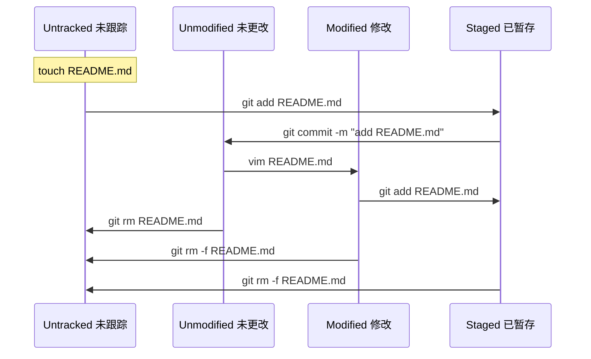
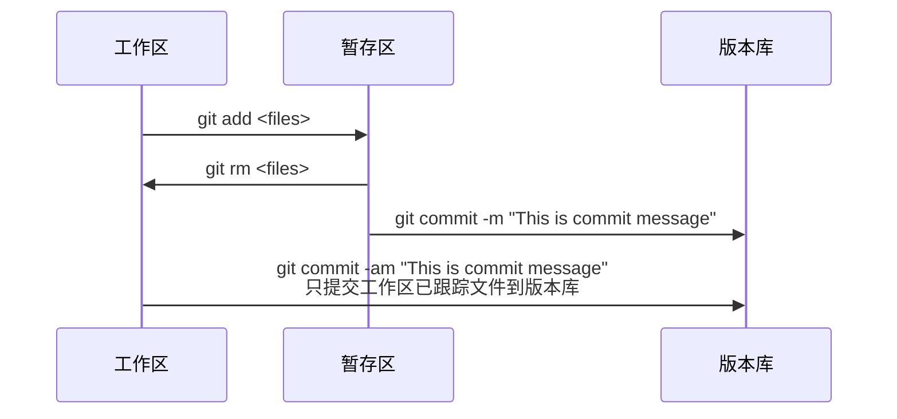

# Git 安装
- 在Ubuntu上安装
    ```
    sudo add-apt-repository ppa:git-core/ppa
    sudo apt update
    sudo apt install git
    ```

- [Git官网](https://git-scm.com)

# Git 初始化
- 初始化用户信息
    ```
    # 初始化用户名与用户邮箱
    git config --global user.name "Your Name"
    git config --global user.email Your@email.com
    ```

- 初始化文本编辑器
    ```
    # 使用VIM
    git config --global core.editor "vim"
    ```

# 获得 Git 仓库
- 初始化仓库
    ```
    git init
    ```

- 克隆仓库
    ```
    git clone <url> 
    ```

# 检查当前文件状态
```
# 获得详细文件状态
git status

# 获得简易文件状态
# ?? 未跟踪
# A  添加入暂存区
# M  修改
# 左侧为暂存区状态，右侧为工作区状态
git status -s
```

# 跟踪新文件
```
git add <files>

# 添加所有未忽略文件
git add .
```

# 忽略文件
需要创建一个`.gitignore`文件  
文件`.gitignore`的格式规范如下:  
```
# 忽略所有的 .a 文件
*.a
# 但跟踪所有的 lib.a，即便你在前面忽略了 .a 文件
!lib.a
# 只忽略当前目录下的 TODO 文件，而不忽略 subdir/TODO
/TODO
# 忽略任何目录下名为 build 的文件夹
build/
# 忽略 doc/notes.txt，但不忽略 doc/server/arch.txt
doc/*.txt
# 忽略 doc/ 目录及其所有子目录下的 .pdf 文件
doc/**/*.pdf
```

# 提交更新
```
# 写入提交信息并且提交暂存区
git commit -m "<commit message>"

# 写入提交信息并且提交所有已跟踪的修改文件
git commit -am "<commit message>"
```

# 移除文件
```
# 将文件从暂存区移除
git rm <files>

# 若文件已修改或者已经add加入暂存，则必须使用强制删除选项 -f
git rm -f <files>

# 若不删除工作区文件，可以使用 --cached
git rm --cached <files>
```

# 一个标准的git本地提交流程
```
# 第一次使用
git init
或者
git clone <url>

# 编辑.gitignore忽略文件
touch .gitignore
vim .gitignore

# 下面为日常提交常用步骤

# 查看当前文件状态
git status

# 将所有文件添加入暂存区
git add .

# 查看文件是否添加入暂存区
git status

# 提交更新
git commit -m "This is commit message"

# 以添加README.md为例
touch README.md
git status
git add .
git status
git commit -m "add README.md"
```

# Git 文件状态变化

## 工作区文件状态变化



## Git 版本管理原理


