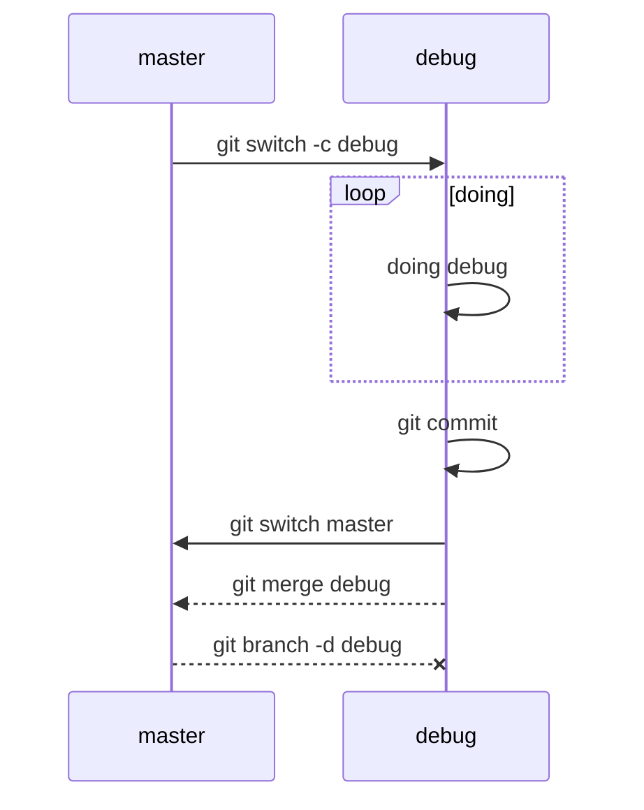

# 创建分支
- 新版 Git
  ```
  git switch -c <branch name>
  ```

- 旧版 Git
  ```
  git checkout -b <branch name>
  ```

- 创建后会切换到新建分支上,若不想切换,可使用
  ```
  git branch <branch name>
  ```

# 切换分支
- 新版 Git
  ```
  git switch <branch name>
  ```

- 旧版 Git
  ```
  git checkout <branch name>
  ```

# 查询分支
```
git branch
```

# 删除分支
```
git branch -d <branch name>

# 如果要丢弃一个没有被合并过的分支，可以强行删除
git branch -D <branch name>
```

# 合并分支
```
# 将当前分支与参数的分支进行合并
git merge <branch name>

# 示例
git switch -c <debug>
<doing debug...>
git switch master
git merge debug

# 上面使用的是Fast forward模式，删除分支后会丢失分支信息
# 可使用以下命令在合并分支时候产生新的提交,保存分支信息
git merge --no-ff -m "<commit message>" dev
```

# debug分支示例


# 分支冲突
若两个分支之间有不相同进度的提交想要进行合并，则可能会产生分支冲突。  
以合并`dev`分支到`master`分支是`README.md`产生冲突为例,按以下步骤处理冲突:  
1. `git merge dev` 合并`dev`分支到`master`,有分支冲突提醒。
2. `git status`查询文件状态，确认冲突文件。
3. 按照文件状态提示确认冲突。
   此时提示`both modified:   README.md`,则需要修改`README.md`文件。
   查看`README.md`文件，发现有以下文本：
   ```
   <<<<<<< HEAD
   234
   =======
   123
   >>>>>>> dev
   ```
   vs code 中有快速处理的选项:
   

   或者采用手动删除，注意删除`<<<<<<<` `=======` `>>>>>>>` 这些Git添加的标识符。
4. `git add README.md` 将冲突文件重新添加入暂存区。
5. `git commit` 提交完成合并分支
- 可以查看到分支合并情况
  ```
  git log --graph --pretty=oneline --abbrev-commit
  ```

# 复制其他分支的提交到当前分支
```
git cherry-pick <commit id>
```
