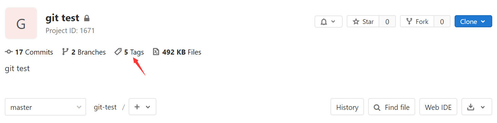
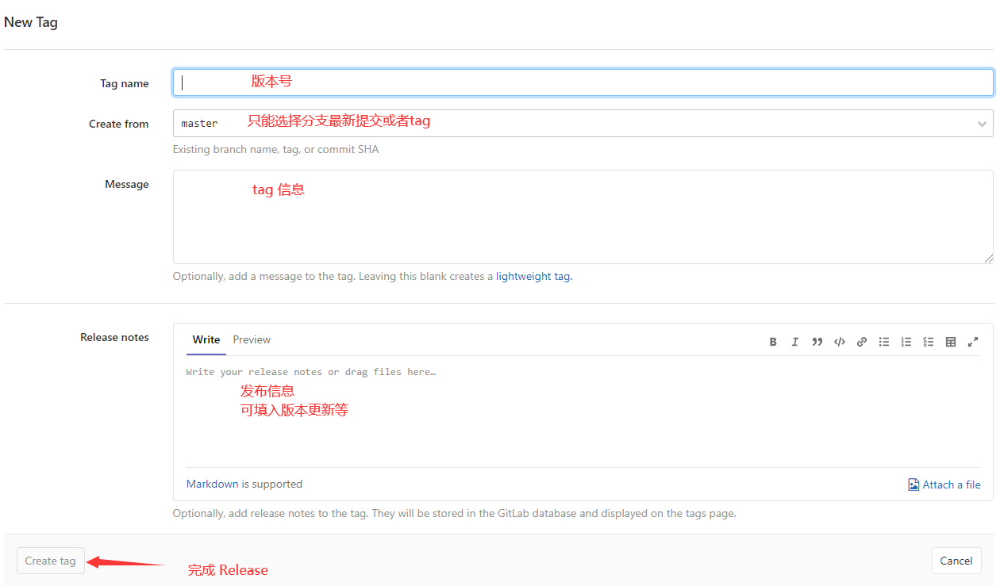
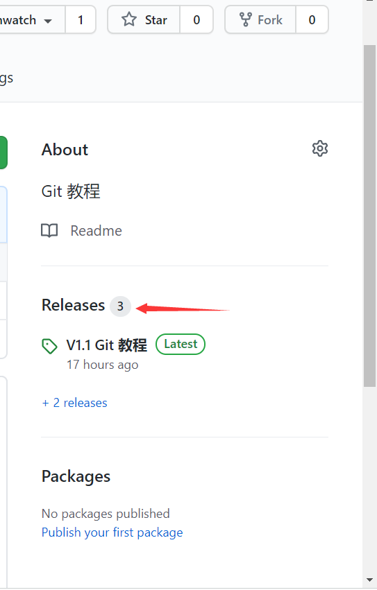
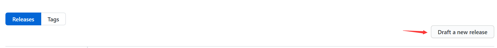
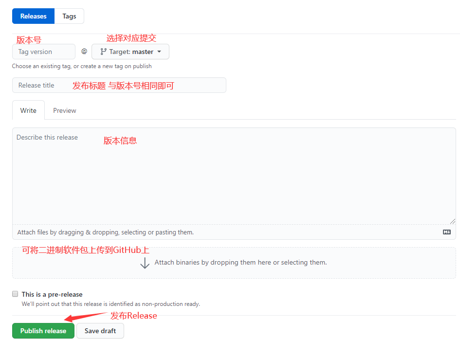

# Releases 发布软件
`Releases`是Git 远程仓库打包和向用户提供软件的方式，可以将其视为使用下载来提供软件的替代。 

使用`Releases`可以提供二进制文件的链接以及描述更改的发行说明。

`Releases`的核心是基于Git的标签`tag`，设置`Releases`同时也是设置一个`tag`，不同远程仓库的设置方法不同，下面介绍GitLab与GitHub的使用方法。

# GitLab
## 操作流程

 

 

GitLab如果想在版本中维护一个编译好的二进制文件，目前不支持界面操作，可以通过GitLab提供的API中名叫links的方式，即外链，文件不会存储到GitLab。使用方法参考下面的参考资料。

## 参考资料
[GitLab Releases 功能](https://blog.csdn.net/a112626290/article/details/105404318)

# GitHub
## 操作流程

 
若第一次创建：  

更新版本：  

 

## 参考资料
[GitHub Releases 功能](https://blog.csdn.net/Eggy2015/article/details/52138751)
