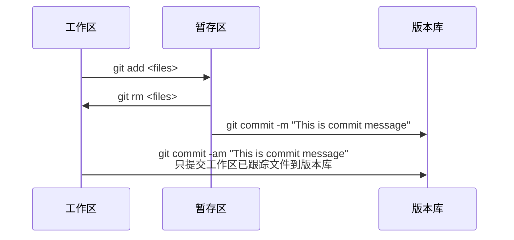

# Git 安装
- 在Ubuntu上安装
    ```
    sudo add-apt-repository ppa:git-core/ppa
    sudo apt update
    sudo apt install git
    ```

- [Git官网](https://git-scm.com)

# Git 初始化
- 初始化用户信息
    ```
    # 初始化用户名与用户邮箱
    git config --global user.name "Your Name"
    git config --global user.email Your@email.com
    ```

- 初始化文本编辑器
    ```
    # 使用VIM
    git config --global core.editor "vim"
    ```

# 获得 Git 仓库
- 初始化仓库
    ```
    git init
    ```

- 克隆仓库
    ```
    git clone <url>
    ```

# 检查当前文件状态
- 获得详细文件状态  
  ```
  git status
  ```

- 获得简易文件状态
  ```
  git status -s
  ```
  左侧为暂存区状态，右侧为工作区状态  
  `??`  未跟踪  
  `A`   添加入暂存区  
  `M`   修改  


# 跟踪新文件
- 添加新文件到暂存区
  ```
  git add <files>
  ```

- 添加所有未忽略文件到暂存区
  ```
  git add .
  ```

# 忽略文件
需要创建一个`.gitignore`文件  
文件`.gitignore`的格式规范如下:  
```
# 忽略所有的 .a 文件
*.a
# 但跟踪所有的 lib.a，即便你在前面忽略了 .a 文件
!lib.a
# 只忽略当前目录下的 TODO 文件，而不忽略 subdir/TODO
/TODO
# 忽略任何目录下名为 build 的文件夹
build/
# 忽略 doc/notes.txt，但不忽略 doc/server/arch.txt
doc/*.txt
# 忽略 doc/ 目录及其所有子目录下的 .pdf 文件
doc/**/*.pdf
```

# 提交更新
- 写入提交信息并且提交暂存区  
  ```
  git commit -m "<commit message>"
  ```

- 写入提交信息并且提交所有已跟踪的修改文件  
  ```
  git commit -am "<commit message>"
  ```

# 查询提交历史记录
- 详细的提交记录
  ```
  git log
  ```

- 简易显示提交记录
  ```
  git log --pretty=oneline
  ```

# 移除文件
- 将文件从库中移除，同时删除工作区文件
  ```
  git rm <files>
  ```

- 若文件已修改或者已经add加入暂存，则必须使用强制删除选项`-f`  
  ```
  git rm -f <files>
  ```

- 若不删除工作区文件，可以使用 --cached  
  ```
  git rm --cached <files>
  ```

# 一个标准的git本地提交流程
- 初始化仓库
  1. 获取仓库
     ```
     git init
     或者
     git clone <url>
     ```

  2. 编辑`.gitignore`忽略文件
      ```
      touch .gitignore
      vim .gitignore
      ```

- 完整的提交流程
  1. 查看当前文件状态
     ```
     git status
     ```
  2. 将文件添加入暂存区
     ```
     git add <files>
     或者
     git add .
     ```
  3. 查看添加入暂存区的文件
     ```
     git status
     ```
  4. 提交更新
     ```
     git commit -m "<commit message>"
     ```

  - 以添加README.md为例  
    ```
    touch README.md  
    git status  
    git add .  
    git status  
    git commit -m "add README.md"  
    ```

# 自定义 Git 命令别名
- `git st`配置为使用`git status`
  ```
  git config --global alias.st 'status'
  ```
- `git last`配置为显示最后一次提交
  ```
  git config --global alias.last 'log -1'
  ```
- `git lg`配置为显示简化提交历史
  ```
  git config --global alias.lg "log --color --graph --pretty=format:'%Cred%h%Creset -%C(yellow)%d%Creset %s %Cgreen(%cr) %C(bold blue)<%an>%Creset' --abbrev-commit"
  ```

# Git 文件状态变化

## 工作区文件状态变化

```mermaid
sequenceDiagram
    participant 0 as No file 无文件
    participant 1 as Untracked 未跟踪 
    participant 2 as Unmodified 未更改
    participant 3 as Modified 修改
    participant 4 as Staged 已暂存

    0 ->> 1:touch README.md

    1->>4:git add README.md

    4->>2:git commit -m "add README.md"

    2->>3:vim README.md

    3->>4:git add README.md

    2->>1:git rm --cache README.md
    3->>1:git rm --cache README.md
    4->>1:git rm --cache README.md

    2 ->> 0 : git rm README.md

    3->>0:git rm -f README.md

    4->>0:git rm -f README.md
```

## Git 版本管理原理

