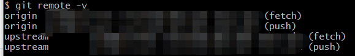
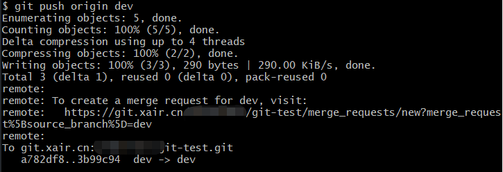

# Git 多人协作
## 确认分支管理策略
在实际开发中，我们应该按照几个基本原则进行分支管理：  
首先，`master`分支应该是非常稳定的，也就是仅用来发布新版本，平时不能在上面干活；  
干活都在`dev`分支上，也就是说，`dev`分支是不稳定的。  
到某个时候，比如1.0版本发布时，再把`dev`分支合并到`master`上，在`master`分支发布1.0版本；  
每个人都在`dev`分支上干活，每个人都有自己的分支，时不时地往`dev`分支上合并就可以了。
所以，团队合作的分支看起来就像这样：  


## 推送自己的分支
- 推送自己的分支修改
  ```
  git push origin <branch-name>
  ```

- 若推送失败，则可能是该分支有领先于本地的提交，需要进行如下操作:  
  1. 拉取远程仓库的最新提交`git pull`。
  2. 若远程仓库提交与你的提交有冲突，按Git 分支管理的[分支冲突](分支管理.md/#分支冲突)章节解决冲突即可。
  3. 再次推送`git push origin <branch-name>`。

## GitHub Flow 多人协作开发方方式
### 简介
GitHub Flow是`GitHub`开源社区的多人协助开发流程,需要确认一个主仓库管理员,该管理员不会上传代码,仅处理从主仓库`Fork`出去的仓库的合并请求.  
主仓库管理员将开发者加入主仓库,给予开发者权限.  
开发者将自己的代码提交到**自己**的`Fork`的远程仓库,然后提交合并请求给主仓库.  
主仓库管理员同意合并请求后即可完成代码的合并提交工作.  
### 开发者操作介绍
#### 初始化本地仓库
1. 开发者从主仓库`Fork`出**自己**的开发仓库,GitLab下示例如下:  
     
     
2. 开发者将**自己**的开发仓库`git clone`到本地进行开发.  
3. 开发者将主仓库的地址加入本地仓库中,可命名为`upstream`.  
   Git 指令为`git remote add upstream <主仓库地址>`  
   使用`git remote -v`可查询远程仓库对应地址.  
     
   `origin`成为开发者`push`的远程仓库,用于提交自己的代码.  
   `upstream`成为开发者`pull`的远程仓库,用于更新自己的代码.  
4. `git switch dev`开发者将分支切换成`dev`分支:
     
5. `git pull upstream dev`获取最新的主仓库代码.
6. 开始开发工作吧~

#### 提交更新
0. 完成一个[本地的提交过程](基础语法.md/#一个标准的git本地提交流程).  
1. `git pull upstream dev`获取最新的主仓库代码,若与本地文件产生了冲突,[解决冲突](分支管理.md/#分支冲突)即可.
2. `git push origin dev`提交更新到**自己**的仓库.  
     
3. 开发者在GitLab网页,**自己**的仓库下发起合并请求.
     
     
     
4. 等待管理员进行审核即可.

#### 管理员要求修改
1. 查看到主仓库管理要求的修改
     
2. 本地修改完成后`git push origin dev`更新到自己的仓库即可,无需再次完成上面的网页操作,因为上一个合并请求并未被取消,GitLab会自动跟踪最新的提交.

### 主仓库管理员操作介绍
#### 建立主仓库
1. 建立一个本地仓库,该仓库存在`master`与`dev`.  
   `git push origin --all`将两个分支都推送上GitLab.  
2. 修改远程仓库的默认分支.  
     
     
3. 在下面选项增加分支保护.  
     
4. 添加开发人员
     

#### 处理合并请求
1. 查看合并请求  
     
2. 处理合并请求  
     
- 若管理员不满意合并请求,可进行评价让其修改:
     

#### 发布新版本  
1. 将`dev`合并到`master`的请求
     
     
     
2. 按上面处理合并请求的方法同意合并即可.
3. 增加[Releases](创建Releases.md/#GitLab/##操作流程),内容为发布版本的版本号.
