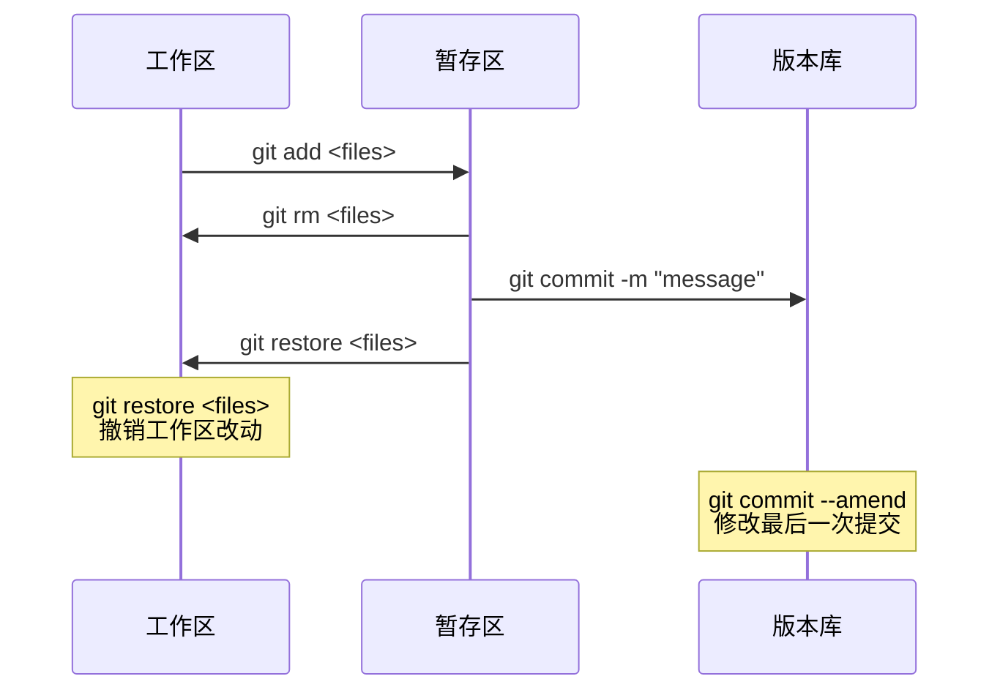

# 修改上次提交
```
# 用最后一次提交覆盖最后一次提交的上一次提交
git commit --amend

# 示例
# 提交后发现漏了添加2.txt文件
git add 1.txt
git commit -m "add 1.txt 2.txt"
git add 2.txt
git commit --amend
# add 1.txt 这个提交将会修改为 git commit --amend 后的提交
```

# 取消暂存的文件
```
# 新版 Git
git restore --staged <files>
# 老板 Git
git reset HEAD <files>

# 如果错误将文件添加入暂存区
git add 1.log
git restore --staged 1.log
# 该指令只撤销将文件提交到缓存区的操作，不会修改文件内容
```

# 撤销对文件的修改
```
# 丢弃工作区的改动
# 新版 Git
git restore <files>
# 老版 Git
git checkout -- <files>

# 注意
# 该命令是 Git 中为数不多的会导致数据丢失的命令
# 请确保不想要这个文件在工作区进行的修改
```

# 回退提交版本版本
```
# 按版本号回退版本
git reset --hard <commit id>

# commit id 可以通过以下命令获取
# 查询提交历史
git log
或者
# 查询操作历史
git reflog

# 按顺序回退版本
# 回退到当前版本（丢弃工作区，暂存区数据）
git reset --hard HEAD
# 回退到上个版本
git reset --hard HEAD^
# 回退到上上个版本
git reset --hard HEAD^^
# 回退到上N个版本
git reset --hard HEAD~N

# 注意
# 该命令是 Git 中为数不多的会导致数据丢失的命令
# 请确保不想要在工作区进行的修改
```

# Git 版本管理原理
