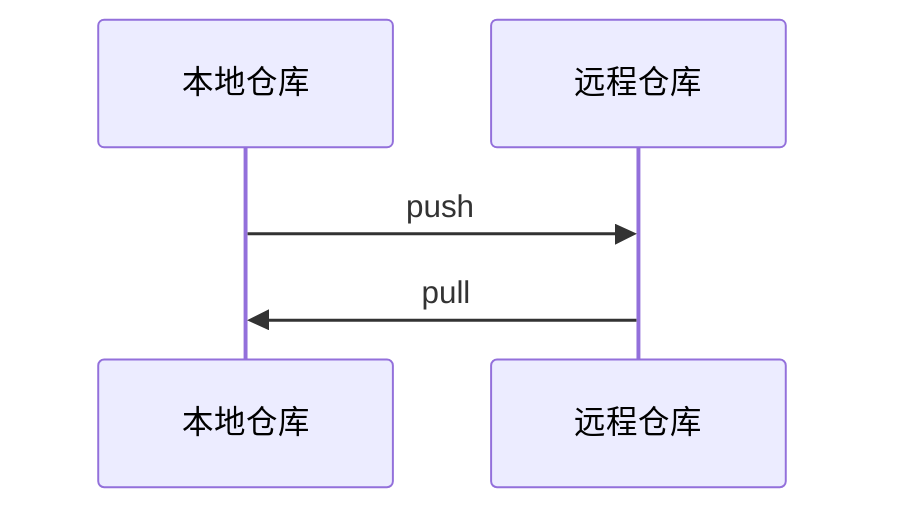

# SSH 密匙初始化
- 创建SSH Key
  ```
  ssh-keygen -t rsa -C "youremail@example.com"
  ```
  会在用户主目录`~`下生成`.ssh`文件夹，文件夹中有:  
  私钥`id_rsa`  
  公钥`id_rsa.pub`  
- 登录Gitlab加载密匙  
  头像->Settings->SSH Keys->填入`id_rsa.pub`内容->Add key
- SSH 警告  
  SSH连接在第一次验证服务器的Key时，需要你确认Key的指纹信息是否真的来自服务器，输入`yes`回车即可

# 远程仓库初始化
- 创建一个新的仓库
  ```
  git clone <url>
  ```

- 推送现有的仓库
  ```
  git remote add origin <url>
  ```
  `origin`是是Git默认的远程库名字，若绑定多个远程仓库，可自行更改别名


# 推送更新到远程仓库
- 第一次推送，推送分支所有内容
  ```
  git push -u origin master
  ```

- 普通推送，推送最新修改
  ```
  git push origin master
  ```

- 推送分支,若远程仓库本身无此分支，则会新建
  ```
  git push origin dev
  ```

# 从远程仓库获取更新
- 获取远程仓库全部更新
  ```
  git pull
  ```

- 获取远程仓库的其他分支
  1. 先获取整个远程仓库
     ```
     git pull
     ```

  2. 查看所有分支
     ```
     git branch -a
     ```

     若远程仓库有其他分支,则会一同显示,例如：
     > \* master  
     remotes/origin/HEAD -> origin/master  
     remotes/origin/dev  
     remotes/origin/master  

   3. 切换到对应的远程仓库分支名字
      ```
      git switch dev
      ```

# Git 远程仓库

